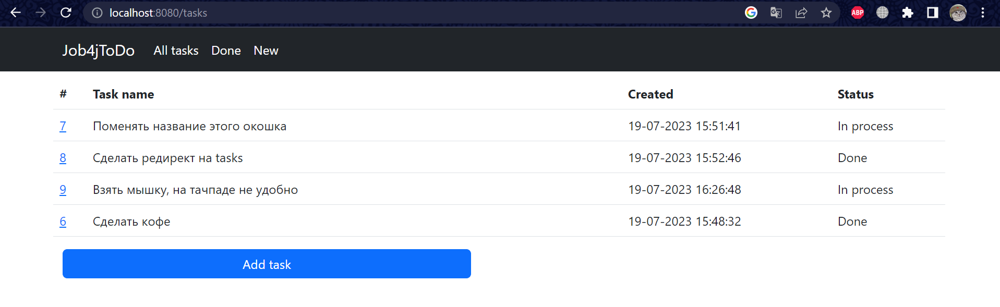
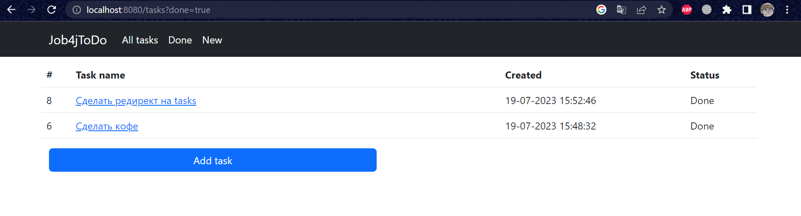

# job4j ToDo  

Todo List – это список дел, которые вам нужно выполнить или того, что вы хотите сделать. На сайте можно добавлять, удалять, редактировать задание, а также менять статус.  

### Стек технологий:  
Spring boot, Thymeleaf, Bootstrap, Hibernate, PostgreSql  

### Требования к окружению:  
Java 17, Maven 3.8, PostgreSQL 14;  

### Запуск приложения:  
-клонировать проект  
-создать базу данных "todo"  
-в папке проекта выпонить команду mvn spring-boot:run  
-в браузере перейти на страницу http://localhost:8080/  

# Взаимодействие с приложением:  
1. Страница со всеми задачами.  
  
2. Страница с выполненными задачами.  
  
3. Страница с не выполненными задачами.  
  
4. Страница для добавления задачи.  
  
5. Страница для обновления, редактирования и удаления.  
  
6. Страница редактирования задачи.  

### Мои контакты  
#### tg: @drinkinswo  

### ToDo List 

